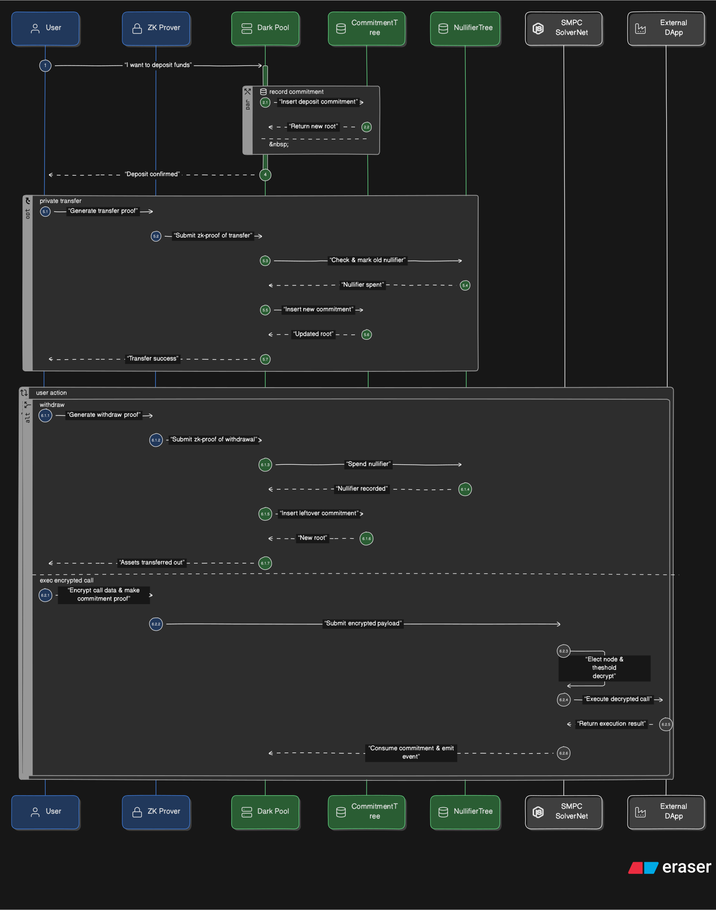
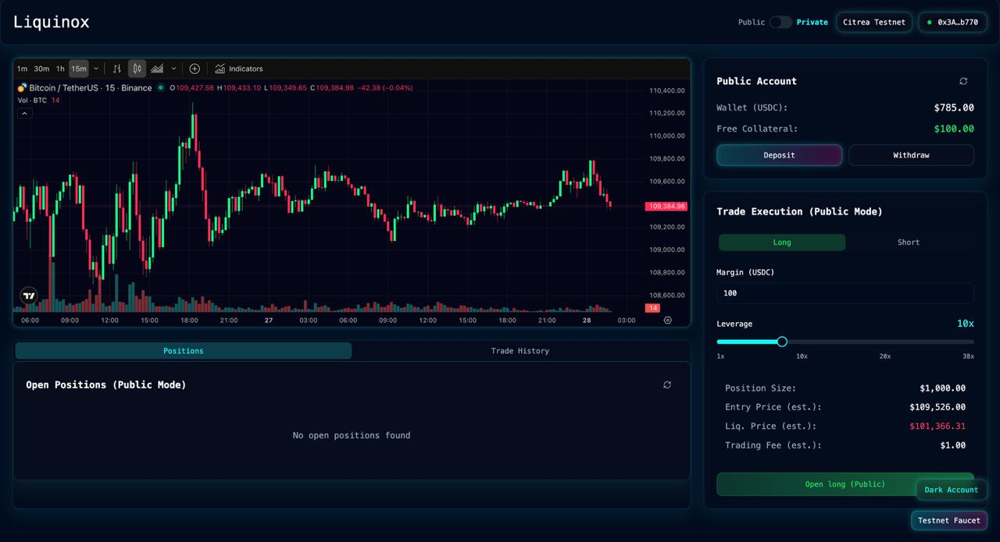
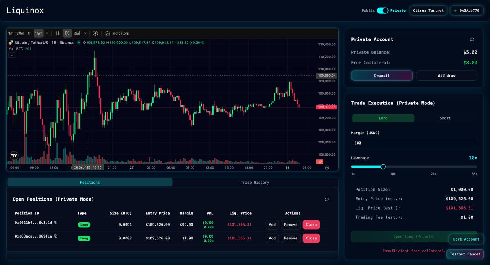
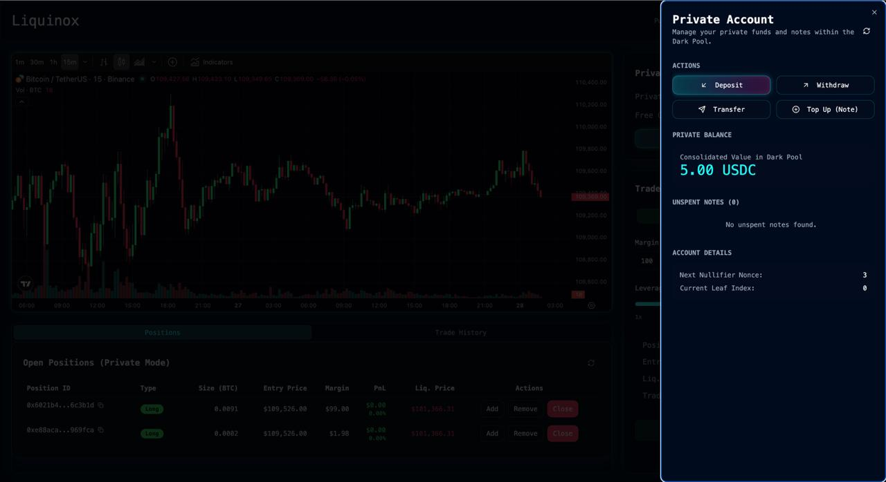
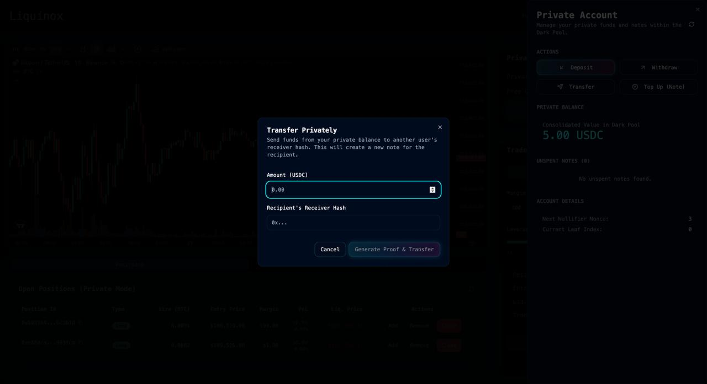
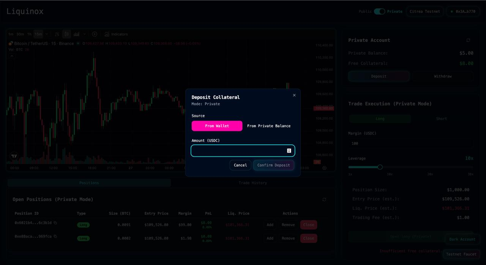
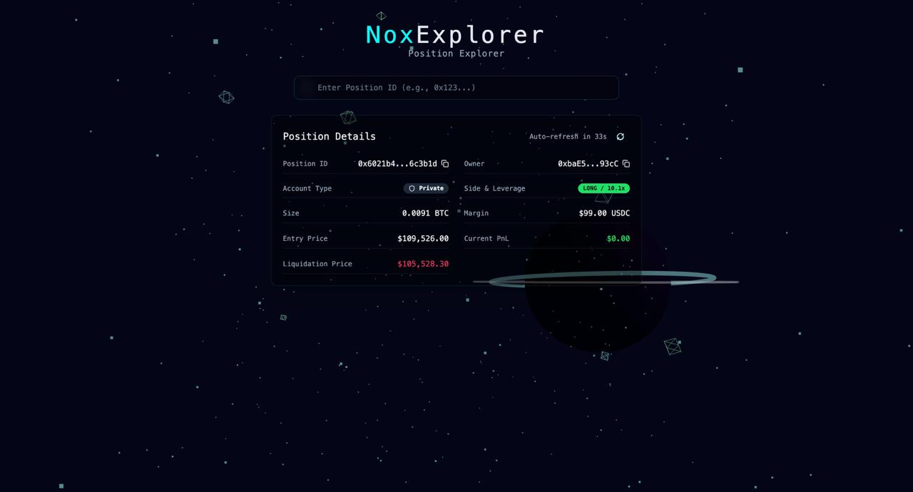

<a name="NOX"></a>

<!-- PROJECT LOGO -->
<br />
<div align="center">
  <a href="https://github.com/r4reetik/nox">
    
  </a>

  <p align="center">
    A privacy-preserving perpetuals dark pool with ZK notes and an off-chain indexer.
    <br />
    <br />
    <a href="#screenshots">Screenshots</a>
  </p>
</div>

<!-- TABLE OF CONTENTS -->

# Table of Contents

  <ol>
    <li>
      <a href="#about-the-project">About The Project</a>
       <ul>
        <li><a href="#security">Security</a></li>
        <li><a href="#signing-data">Signing Data</a></li>
      </ul>
    </li>
    <li><a href="#usage">Usage</a></li>
    <li><a href="#built-with">Built With</a></li>
    <li><a href="#installation">Installation</a></li>
    <li><a href="#usage">Usage</a></li>
    <li><a href="#road-map">Road Map</a></li>
     <li><a href="#acknowledgments">Acknowledgments</a></li>

  </ol>

<!-- ABOUT THE PROJECT -->

</br>

# About The Project

Nox is a privacy-preserving perpetuals protocol that lets users manage collateral and trade via a dark pool using zero-knowledge proofs. Users create private notes (commitments) inside the dark pool and can bridge liquidity to a minimal perpetuals DEX through a `PrivacyProxy` that holds positions publicly while preserving the user's private identity through signatures derived from a locally generated secret.

Nox operates on three layers:

1. Smart contracts (dark pool + proxy + minimal perp DEX):

   - `TokenPool` maintains a Poseidon-based Merkle tree of commitments, verifies Noir proofs, and issues transferable private notes. It supports deposit, withdraw, transfer, claim, and approval flows for moving funds to/from the proxy.
   - `PrivacyProxy` manages user free collateral and opens/closes positions on the public `ClearingHouseV2`. Ownership is tracked by a user public key derived from their secret; actions are authorized with signatures over typed messages.
   - `ClearingHouseV2` is a simple perpetuals engine with oracle-driven pricing and margin accounting. All positions are owned by the proxy.

2. Off-chain services (Rust):

   - `backend/indexer`: Axum API + Sled DB indexing on-chain events from `PrivacyProxy`, `TokenPool`, and `ClearingHouseV2`. It exposes public and private endpoints for positions, unspent notes, and encrypted user metadata.
   - `backend/oracle`: a bot that fetches BTC/USD prices from Pyth and can update the on-chain oracle used by the clearing house.

3. Frontend (React + Vite):
   - A React app that guides users through creating a private client identity, depositing into the dark pool, managing positions, and generating/verifying ZK proofs via Noir. It communicates with the indexer for private data and the blockchain via `ethers`/`wagmi`.

Deployed Contract links:

- Dev/local-first; configure chain addresses in `frontend/src/lib/contracts.ts` and backend env. Example `ignition/deployments` folder contains deployment artifacts for chain 5115.

<p align="right">(<a href="#table-of-contents">back to top</a>)</p>

# Flow

<div align="center">
  
</div>

# Screenshots

<p float="left">
  
   
  
  </br>
  
  
  
</p>

<p align="right">(<a href="#table-of-contents">back to top</a>)</p>

<!-- SECURITY VERIFICATIONS -->

# Security

- ZK verification in `TokenPool` is enforced via Noir proofs validated on-chain by pluggable verifiers:

```
require(
    withdrawVerifier.verify(params.honkProof, params.publicInputs),
    "AssetPool: Invalid withdraw proof"
);
```

- Commitments use Poseidon2 over field elements and a rolling root set; nullifiers prevent double-spends and roots are windowed to mitigate replay.

```
function check_and_spend_nullifier(bytes32 _nullifier) internal {
    require(!isNullifierSpent[_nullifier], "AssetPool: Nullifier already spent");
    isNullifierSpent[_nullifier] = true;
}
```

- Proxy-side action authorization derives a user public key from their secret and verifies ECDSA signatures against message digests:

```
function _verifySignature(bytes32 _pubKey, bytes32 _messageHash, bytes memory _signature) internal pure {
    bytes32 digest = MessageHashUtils.toEthSignedMessageHash(_messageHash);
    address recoveredAddress = ECDSA.recover(digest, _signature);
    if (keccak256(abi.encodePacked(recoveredAddress)) != _pubKey) revert InvalidSignature();
}
```

- Deterministic note IDs are computed as keccak(asset, noteNonce) ensuring predictable indexing for off-chain services, and events are emitted for indexing:

```
bytes32 noteID = keccak256(abi.encodePacked(address(asset), noteNonce));
emit NoteCreated(receiverHash, amount, noteNonce);
```

<p align="right">(<a href="#table-of-contents">back to top</a>)</p>

<!--SIGNING DATA -->

# Signing Data

The frontend creates a private trading identity using a signed message from the user's wallet, deriving a long-lived secret. Actions against the `PrivacyProxy` use messages like:

```
keccak256(abi.encodePacked("OPEN_POSITION", positionId, margin, leverage, isLong))
```

The indexer authenticates private API requests by deriving the same public key server-side from headers `X-Message` and `X-Signature`, recovering the address and hashing it with keccak256 to match the on-chain/public key representation.

<p align="right">(<a href="#table-of-contents">back to top</a>)</p>

# Built With

- React + Vite + TypeScript
- Noir + Barretenberg (ZK circuits and proof generation)
- Ethers v6, Wagmi, RainbowKit
- Solidity (OpenZeppelin, custom Poseidon libs)
- Rust (Axum, Ethers-rs, Sled)

<p align="right">(<a href="#table-of-contents">back to top</a>)</p>

# Installation

- Prerequisites:

  - Node.js 18+, pnpm/yarn, Rust (nightly not required), Foundry/Hardhat for contracts
  - `circuits` require Noir toolchain; see `circuits/README` if present

- Contracts:

  - Navigate to `contracts/`, install deps, and deploy to your target chain. Deployment artifacts are expected under `contracts/ignition/deployments/...`.

- Backend:

  - `cd backend/indexer` and create a `.env` with:
    - `RPC_URL=ws(s)://...` (WebSocket or HTTP; indexer converts to HTTP for polling)
    - `PRIVACY_PROXY_ADDRESS=0x...`
    - `TOKEN_POOL_ADDRESS=0x...`
    - `TOKEN_ADDRESS=0x...` (collateral token)
    - `DB_PATH=./db`
    - `SERVER_BIND_ADDRESS=0.0.0.0:3000`
  - Run: `cargo run`

  - `cd backend/oracle` and create a `.env` with:
    - `RPC_URL=https://...`
    - `PRIVATE_KEY=0x...`
    - `ORACLE_CONTRACT_ADDRESS=0x...`
    - `PRICE_CHANGE_THRESHOLD=0.01` (1% threshold)
  - Run: `cargo run`

- Frontend:
  - `cd frontend`
  - `pnpm install` (or `yarn`)
  - Create `.env` with:
    - `VITE_INDEXER_API_URL=http://localhost:3000`
  - `pnpm dev` to start the app

<p align="right">(<a href="#table-of-contents">back to top</a>)</p>

<!-- USAGE EXAMPLES -->

# Usage

- Deposit into the dark pool by generating a precommitment and submitting a transaction via the EntryPoint/TokenPool.
- Generate ZK proofs in the app to withdraw/transfer/claim, producing new commitments and nullifiers.
- Approve withdrawal to the `PrivacyProxy` to bridge private balance into the perp DEX collateral balance.
- Trade via the proxy: open/close positions, manage margin. Indexer exposes both public positions (owner is EOA) and private positions (owner is pubKey) depending on the event source.
- Withdraw collateral back into the dark pool as a new note for further private transfers.

The indexer offers:

- Public: `/positions/open/{address}`, `/positions/history/{address}`, `/positions/{positionId}`
- Private: `/private/positions/open`, `/private/positions/history`, `/private/notes/unspent`, `/private/metadata` (requires `X-Message` and `X-Signature` headers)

<p align="right">(<a href="#table-of-contents">back to top</a>)</p>

<!-- ROADMAP -->

# Road Map

- [x] Dark pool with Poseidon commitments and Noir verification
- [x] Privacy proxy for perp DEX collateral and positions
- [x] Minimal `ClearingHouseV2` + oracle integration
- [x] Rust indexer and private API with metadata storage
- [x] React frontend with ZK proof generation flows

Features proposed for future:

- [ ] Batch joins/splits and multi-claim in TokenPool
- [ ] Additional assets and pools
- [ ] Enhanced proof gadgets and circuit audits
- [ ] Production-grade indexer persistence and pagination
- [ ] Extended privacy for on-chain interactions (e.g., relaying)

<p align="right">(<a href="#table-of-contents">back to top</a>)</p>

<!-- ACKNOWLEDGMENTS -->

# Acknowledgments

This repo was built for ETHIndia as a privacy-preserving perpetuals dark pool. It draws on Noir, OpenZeppelin, and community Poseidon implementations. Thanks to the maintainers of `ethers-rs`, `axum`, and the Noir ecosystem.

<p align="right">(<a href="#table-of-contents">back to top</a>)</p>
